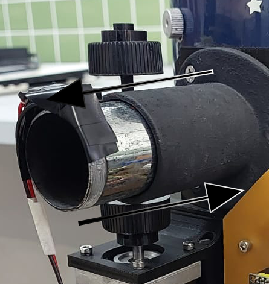
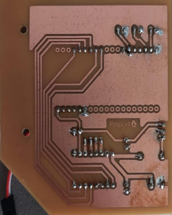
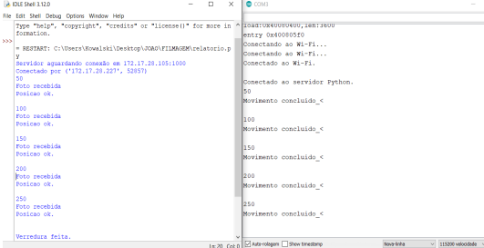
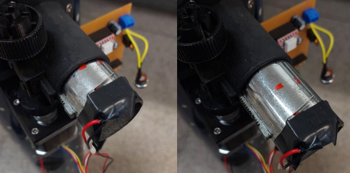
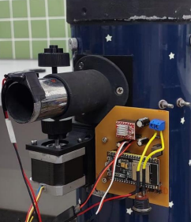

# System for automatic focus adjustment in telescope eyepiece lens

## Work Plan
</h1>

With the technological development achieved in recent decades, the modernization of modest, lower-cost instruments, which can serve the teaching of Astronomy, has greatly benefited. In this context, the project proposes the implementation of a system capable of automatically adjusting the eyepiece lens of the telescope at the [IFES](https://guarapari.ifes.edu.br) Guarapari campus observatory ([OAIG](https://guarapari.ifes.edu.br/index.php/pesquisa-pos-graduacao-e-extensao/264-direcao/diretoria-de-pesquisa-pos-graduacao-e-extensao/extensao/extensao-2020/16797-oaig-projextensao2020)), with [Lab Penguin](https://github.com/Lab-Penguin). This system not only improves the quality of astronomical observations, but also facilitates access and experience for all who frequent the environment, promoting broader inclusion and providing an educational and scientific experience to individuals.
 

## Stepper motor lens movement algorithm
</h1>

The first stage of the project was the development of a system to move the telescope lens. A stepper motor and a microcontroller were selected. To control this motor, the chosen microcontroller was the [ESP32](https://www.espressif.com/en/products/socs/esp32). Although Arduino is very popular, the ESP32 stands out mainly for having Wi-Fi communication (and Bluetooth, which was not used in this project), for a higher processing speed and a smaller size compared to the Arduino Uno and Mega. The programming environment to develop this system was the Arduino IDE and the language, C++.

The lens movement was as follows:

  

## Image focus quantification
</h1>

Having created the lens movement algorithm, the process of studying image processing in Python began, with the implementation of the [OpenCV](https://opencv.org/) library.

This library is used in the development of projects in the areas of image processing and computer vision.
 

Furthermore, code was developed that can take photos and analyze whether the images were in focus or not. This analysis is done by comparing a "threshold," determined by the user, with the image's focus value, which is returned after image processing is performed in the function.

## Communication between Server and Client and choosing the best lens position
</h1>

The communication used was via [Socket](https://socket.io/docs/v4/), between the computer and the microcontroller, which uses the Client/Server model.
 

## Printed circuit board
</h1>

Once communication was finalized, the printed circuit board was created using [Eagle](https://www.autodesk.com/br/products/eagle/overview.acessado) prototyping software. The use of this resource was necessary due to the number of connections between the motor and microcontroller, along with other important electronic components, to ensure the circuit functioned properly and safely.

The board is powered by a 12V power supply. This power supply directly powers the motor and an LM7805 voltage regulator, which reduces the voltage to 5V to power the ESP32. It contains three capacitors indicated in the A4988 stepper motor driver datasheet, a safety diode to prevent a possible short circuit, and auxiliary connectors.

The next figure illustrates how the board looked with the circuits connected.

  

 

## System in operation
</h1>

The following figure illustrates the Python code, using the Socket library, sending a steps value defined by the user command. This value reached the ESP32 and was written to the Arduino IDE terminal.

  

Subsequently, the ESP32 code was completed to use this received value to rotate the motor and move the telescope lens. The following figure shows the lens positions before (left) and after (right) the step command sent by the user.

  

Another type of experiment was conducted to confirm whether the focus estimation system was working correctly, in order to subsequently define the best position for the telescope lens.

For this, several photos were taken of focused and out-of-focus scenes. These photos were passed through the focus estimation algorithm and the focus values ​​were calculated. The following figure shows some examples of tested images, in red, the value estimated by the algorithm and whether it is considered focused or not.

  

Finally, the entire system was mounted on the telescope, and the next figure shows what the telescope's structure looked like at the end of the project.

  

 

## Discussions and final considerations
</h1>

The experiments conducted at the end of the project yielded satisfactory results for the work's objective, validating the system. The model proved capable of: correctly capturing the image, quantifying its focus value; sending and receiving information with the Socket communication to move the stepper motor; performing this process in a loop until the scan is completed; and positioning the lens in the position with the best focus. Even with wear on the gear responsible for moving the lens and the loss of a few motor steps over time, the final operation of the system was not significantly affected.

The telescope is now ready for implementation, along with the camera adaptation and automation systems for astrophotography and automatic adjustment of the telescope's position via Stellarium for viewing.
 
